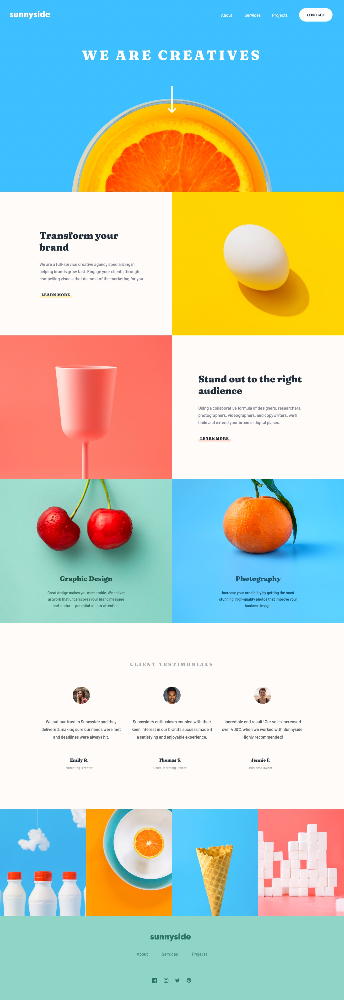
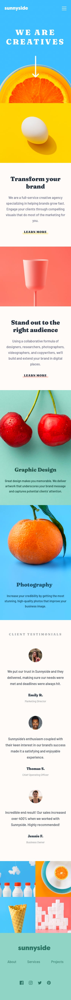

# 🍊 Sunnyside Agency Landing Page

A vibrant, pixel-perfect landing page for a creative agency built with pure HTML & CSS. This project showcases modern responsive design techniques and smooth user interactions.

[](https://yourusername.github.io/sunnyside-agency-landing-page)
[](https://www.frontendmentor.io/challenges/sunnyside-agency-landing-page-7yVs3B6ef)

## ✨ Features

🎨 **Pixel-Perfect Design** - Faithfully recreated from Figma designs  
📱 **Fully Responsive** - Seamless experience from mobile to 4K displays  
🍔 **CSS-Only Menu** - No JavaScript needed for the hamburger navigation  
⚡ **Optimized Images** - Responsive images that adapt to screen size  
🎭 **Smooth Animations** - Hover effects and transitions throughout  
♿ **Semantic HTML** - Clean, accessible markup  

## 🖼️ Screenshots

### Desktop View


### Mobile View


## 🚀 Live Demo

👉 **[View Live Site](https://yourusername.github.io/sunnyside-agency-landing-page)**

## 🎯 The Challenge

Build a fully responsive agency landing page that:
- Adapts beautifully to any screen size
- Provides intuitive navigation on mobile and desktop
- Includes hover states for interactive elements
- Maintains design fidelity across all breakpoints

## 🛠️ Built With

- **HTML5** - Semantic markup
- **CSS3** - Modern layouts with Grid & Flexbox
- **Mobile-First Workflow** - Progressive enhancement approach
- **Google Fonts** - Barlow & Fraunces typography
- **Picture Element** - Responsive image optimization

## 💡 What I Learned

This project pushed my frontend skills to the next level! Here's what I mastered:

🔷 **Advanced CSS Grid Techniques** - Creating complex 50/50 layouts where content and images swap positions seamlessly across breakpoints

🔷 **Responsive Image Strategy** - Implementing the `<picture>` element to serve optimized images based on viewport size for better performance

🔷 **CSS-Only Interactions** - Building a fully functional hamburger menu without any JavaScript using the checkbox hack

🔷 **Precise Positioning** - Controlling image display with object-fit and object-position for perfect hero sections

🔷 **Mobile-First Mindset** - Designing for small screens first, then progressively enhancing for larger displays

🔷 **Grid Display Contents** - Using `display: contents` to break out of grid containers and create flexible layouts

## 🎨 Design Decisions

**Color Palette**  
Vibrant, energetic colors that reflect the creative agency vibe - bright oranges, soft pinks, and refreshing blues.

**Typography**  
- Barlow 600 for body text - clean and readable
- Fraunces 700/900 for headings - bold and attention-grabbing

**Layout Strategy**  
Mobile-first approach with breakpoints at 768px, 1024px, 1200px, and 1440px for optimal viewing across all devices.

## 📂 Project Structure

```
sunnyside-agency/
├── 📄 index.html
├── 🎨 style.css
├── 📖 README.md
├── 🖼️ images/
│   ├── desktop/
│   ├── mobile/
│   └── icons/
└── 📸 screenshots/
```

## 🚀 Quick Start

1. **Clone the repo**
   ```bash
   git clone https://github.com/yourusername/sunnyside-agency-landing-page.git
   ```

2. **Navigate to directory**
   ```bash
   cd sunnyside-agency-landing-page
   ```

3. **Open in browser**
   - Simply open `index.html` in your favorite browser
   - Or use a local server for best results

## 🌟 Key Highlights

✨ **Zero JavaScript** - Pure CSS magic for all interactions  
⚡ **Lightning Fast** - Optimized images and minimal CSS  
📐 **Pixel Perfect** - Matches the original design down to the pixel  
🎯 **SEO Ready** - Semantic HTML and proper meta tags  
♿ **Accessible** - WCAG compliant markup  

## 🎓 Continued Development

Areas I'm exploring next:
- Adding subtle CSS animations for page load
- Implementing dark mode toggle
- Enhancing accessibility with ARIA labels
- Adding form validation for contact section
- Experimenting with CSS custom properties for theming

## 🙏 Acknowledgments

- Design by [Frontend Mentor](https://www.frontendmentor.io) - Amazing challenges!
- Fonts from [Google Fonts](https://fonts.google.com/)
- Inspiration from countless creative agencies worldwide

## 👨‍💻 Author

**Your Name**

- 💼 LinkedIn: [Your Name](https://www.linkedin.com/in/princy-dhanciya-46a58a2b4)
- 🎨 Frontend Mentor: [@yourusername](https://www.frontendmentor.io/profile/princyDhanciya)


---

## 📊 Stats

⏱️ **Time Spent:** ~X hours  
📱 **Breakpoints:** 4 (375px, 768px, 1024px, 1440px)  
🎨 **Colors Used:** 10  
📸 **Images:** 11  
💯 **Browser Support:** Chrome, Firefox, Safari, Edge  

---

<div align="center">

### ⭐ Star this repo if you found it helpful!

Made with ❤️ and lots of ☕

[Report Bug](https://github.com/yourusername/sunnyside-agency-landing-page/issues) · [Request Feature](https://github.com/yourusername/sunnyside-agency-landing-page/issues)

</div>
