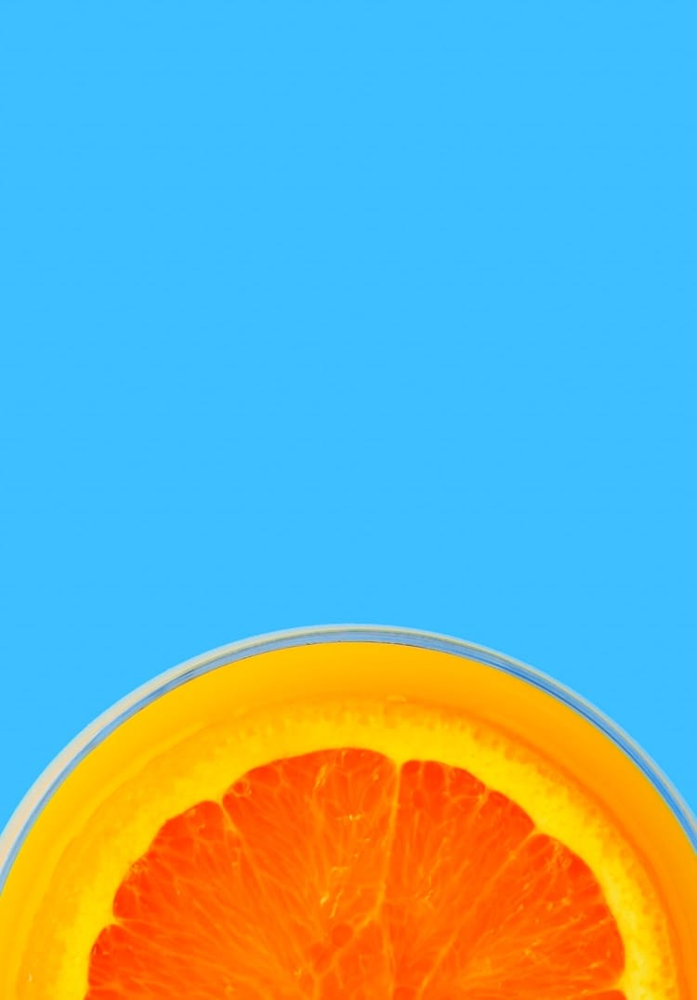

# Frontend Mentor - Sunnyside agency landing page solution

This is a solution to the [Sunnyside agency landing page challenge on Frontend Mentor](https://www.frontendmentor.io/challenges/sunnyside-agency-landing-page-7yVs3B6ef). Frontend Mentor challenges help you improve your coding skills by building realistic projects.

## Table of contents

- [Overview](#overview)
  - [The challenge](#the-challenge)
  - [Screenshot](#screenshot)
  - [Links](#links)
- [My process](#my-process)
  - [Built with](#built-with)
  - [What I learned](#what-i-learned)
  - [Continued development](#continued-development)
- [Author](#author)

## Overview

### The challenge

Users should be able to:

- View the optimal layout for the site depending on their device's screen size
- See hover states for all interactive elements on the page

### Screenshot


### Links

- Solution URL: [GitHub Repository](https://github.com/yourusername/sunnyside-agency-landing-page)
- Live Site URL: [Live Demo](https://yourusername.github.io/sunnyside-agency-landing-page)

## My process

### Built with

- Semantic HTML5 markup
- CSS custom properties
- Flexbox
- CSS Grid
- Mobile-first workflow
- Responsive images with `<picture>` element
- CSS-only hamburger menu

### What I learned

This project helped me strengthen my understanding of several key concepts:

**1. Responsive Images with Picture Element**
```html
<picture>
  <source media="(min-width: 768px)" srcset="./images/desktop/image-header.jpg">
  
</picture>
```

**2. CSS Grid with display: contents**
I learned how to use `display: contents` to create a flexible 50/50 layout where images and content swap positions:
```css
.features {
  grid-template-columns: 1fr 1fr;
}

.feature {
  display: contents;
}

.feature:nth-child(1) .feature-image {
  grid-column: 2;
  grid-row: 1;
}
```

**3. CSS-Only Hamburger Menu**
Implemented a fully functional mobile navigation menu using only CSS with the checkbox hack:
```css
#menu-toggle:checked ~ nav {
  opacity: 1;
  pointer-events: all;
}
```

**4. Positioning and Object-fit**
Learned to control how background images are displayed:
```css
.hero-bg {
  object-fit: cover;
  object-position: center bottom;
}
```

### Continued development

Areas I want to continue focusing on:

- Advanced CSS Grid techniques for complex layouts
- CSS animations and transitions for smoother interactions
- Accessibility improvements (ARIA labels, keyboard navigation)
- Performance optimization for image loading
- Advanced responsive design patterns

### Useful resources

- [CSS Grid Guide](https://css-tricks.com/snippets/css/complete-guide-grid/) - Comprehensive guide to CSS Grid
- [Responsive Images](https://developer.mozilla.org/en-US/docs/Learn/HTML/Multimedia_and_embedding/Responsive_images) - MDN guide on responsive images
- [A11y Project](https://www.a11yproject.com/) - Accessibility best practices

## Author

- Website - [Your Name](https://www.your-site.com)
- Frontend Mentor - [@yourusername](https://www.frontendmentor.io/profile/yourusername)
- GitHub - [@yourusername](https://github.com/yourusername)
- LinkedIn - [Your Name](https://www.linkedin.com/in/yourusername)

---

## Project Structure

```
sunnyside-agency-landing-page/
├── index.html
├── style.css
├── README.md
├── images/
│   ├── desktop/
│   │   ├── image-header.jpg
│   │   ├── image-transform.jpg
│   │   ├── image-stand-out.jpg
│   │   ├── image-graphic-design.jpg
│   │   ├── image-photography.jpg
│   │   └── gallery images...
│   ├── mobile/
│   │   └── (same structure as desktop)
│   ├── icon-arrow-down.svg
│   ├── icon-facebook.svg
│   ├── icon-instagram.svg
│   ├── icon-twitter.svg
│   └── icon-pinterest.svg
└── screenshots/
    ├── desktop-view.png
    └── mobile-view.png
```

## Installation & Usage

1. Clone the repository:
```bash
git clone https://github.com/yourusername/sunnyside-agency-landing-page.git
```

2. Navigate to the project directory:
```bash
cd sunnyside-agency-landing-page
```

3. Open `index.html` in your browser or use a local server:
```bash
# Using Python
python -m http.server 8000

# Using Node.js
npx serve
```

4. View the site at `http://localhost:8000`

## Features

✅ Fully responsive design (375px - 1440px+)  
✅ Mobile-first approach  
✅ CSS-only hamburger menu  
✅ Optimized images for different screen sizes  
✅ Smooth hover effects  
✅ Semantic HTML5  
✅ Clean, maintainable CSS  

## Acknowledgments

- Design provided by [Frontend Mentor](https://www.frontendmentor.io)
- Fonts from [Google Fonts](https://fonts.google.com/) (Barlow & Fraunces)
- Icons and images provided in the challenge starter files

---

**⭐ If you found this helpful, please consider giving it a star!**
